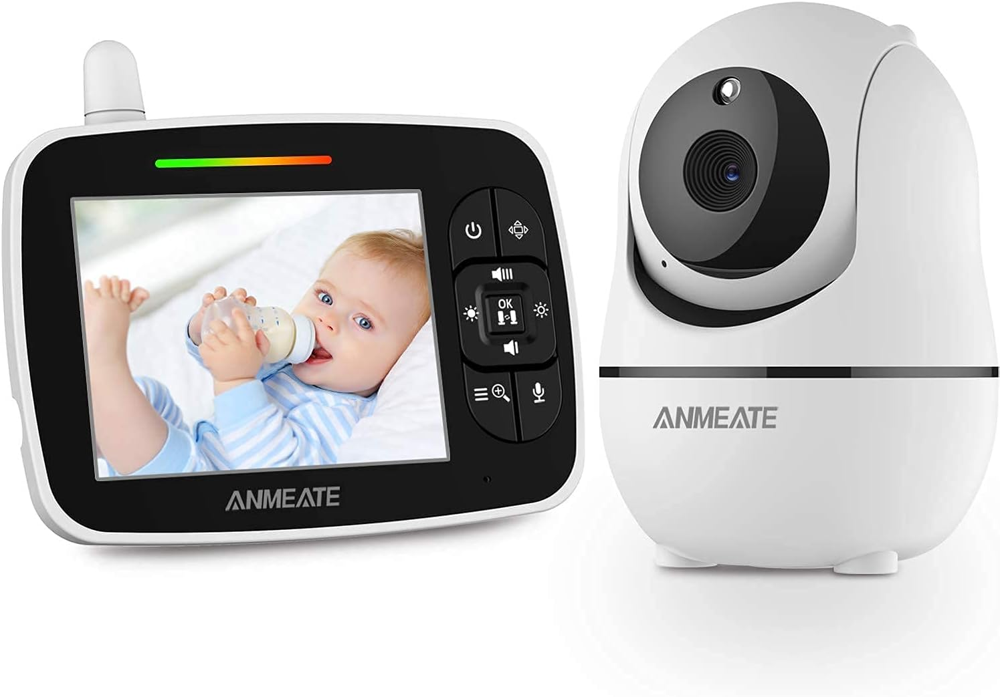

# Remote Baby Monitoring System

## Project Description

In today's fast-paced world, parents often struggle to effectively monitor and care for their babies due to demanding work schedules. While baby monitoring systems equipped with cameras exist, a comprehensive solution that not only monitors the baby but also identifies their emotions is lacking. This project aims to address this gap by employing machine learning techniques to recognize the emotional cues within a baby's cries and by offering remote monitoring and interaction features through a dedicated mobile app.

## Features

1. **Motion Detection Alert**: Receive real-time alerts on your mobile app when the baby wakes up, utilizing motion detection sensors.
2. **Cry Detection**: Receive notifications when the baby is crying, with the ability to distinguish cries from background noise.
3. **Emotion Recognition**: Identify the emotional context of the crying, such as hunger, discomfort, tiredness, or belly pain, using machine learning algorithms.
4. **Live Video Monitoring**: Observe the baby's condition through the integrated camera system, accessible via the mobile app.
5. **Two-way Communication**: Communicate with the baby remotely through the mobile app's audio features.

## Project Components

1. **Embedded System Source Code**: Includes the source code for the embedded system.
2. **PCB Design Files**: Contains design files for the printed circuit board (PCB) of the system.
3. **Machine Learning Model**: Provides the trained machine learning model used for emotion recognition.
4. **Training Dataset**: Includes the dataset used to train the machine learning model.
5. **3D Model of Enclosure Design**: Visual representation of the enclosure design.

## Technologies and Hardware Utilized

1. **ESP Camera Module**: Integrates camera functionality into the system.
2. **TensorFlow Lite**: Utilized for training the emotion recognition model.
3. **Android Studio**: Facilitates creation of mobile app.
4. **I2S protocol**: Used for communication of audio files.
5. **EasyEDA**: Utilized for designing the PCB board.
6. **Altium Designer**: Used to create the 3D design of the enclosure.
7. **INM5441 Microphone**: Microphone with inbuilt amplifer and I2S coomunication interface.
8. **PAMPAM8403 Amplifier**
9. **Keyes Active Speaker**
10. **PIR Sensor**

## Credits

1. **Donateacry-corpus Dataset** by gveres: [GitHub Repository](https://github.com/gveres/donateacry-corpus)
2. **A review of infant cry analysis and classification**: A research paper reviewing recent works in infant cry signal analysis - [Link](https://asmp-eurasipjournals.springeropen.com/articles/10.1186/s13636-021-00197-5)
3. **Audio Classification using TensorFlow**: TensorFlow's guide on audio classification - [Link](https://www.tensorflow.org/lite/examples/audio_classification/overview)
4. **Audio Feature Extraction**: Information on audio feature extraction - [Link](https://devopedia.org/audio-feature-extraction#:~:text=Audio%20feature%20extraction%20is%20a,converting%20digital%20and%20analog%20signals.)
5. **Deep Learning for Baby Crying Classification**: An informative article on deep learning to classify baby crying sounds - [Link](https://towardsdatascience.com/deep-learning-for-classifying-audio-of-babies-crying-9a29e057f7ca)
